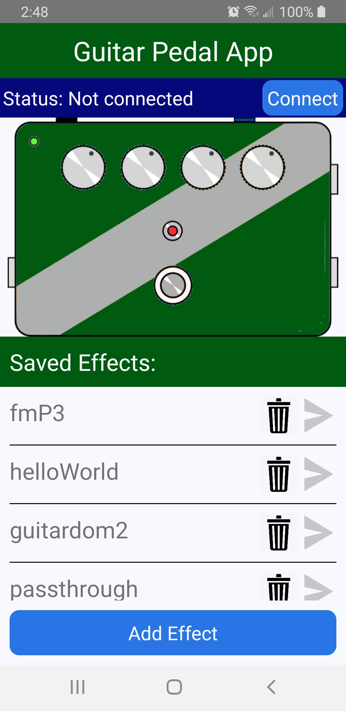
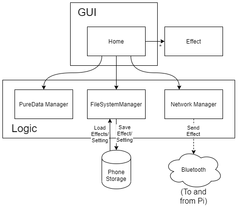

# Guitar Pedal App

#### This project is a mobile application written in React Native as a companion app to go along with a custom-built guitar effects pedal that utilizes PureData. PureData allows for user-created custom effects and this project attempts to allow them to be imported into this React Native application, saved, and then sent to the custom-built pedal. The specifications of this pedal are located on Hackaday.io here: 
#### https://hackaday.io/project/171186-the-guitar-pedal-project-multi-effect-processor
#### This project was done by a small team for a senior design project at Milwaukee School of Engineering in the 2019-2020 school year.

## Screenshot

## Version
#### Currently used version of React Native: v0.59.10

## Dependencies
- react-native-gesture-handler v1.2.1
- react-native-bluetooth-classic v0.10.6
- react-native-document-picker v3.3.3
- react-native-fs v2.16.2

## Future
- Add method for user to connect pedal's tone knobs to specific inputs in an effect's PureData file (as right now it must be done by adding the smooth_knobs.pd object manually to the file).
  - This might involve creating a mini PureData file editing screen, which in that case much more could be done with that.
- Add indicator showing what effect is currently on the pedal (involves work on the pedal side as well) and other user feedback for sending effects.
- Fix bugs
- Figure out a way to detect Bluetooth disconnection (not working currently).
- Fix incorrectly importing file

## App Design & Architecture
#### The purpose behind this app is provide a simple and slick interface for any guitarist or other musician who likes to experiment with creating their own effects to import PureData files into the app, store them there for easy access, and then connect to a custom-built guitar effect pedal via Bluetooth and send the desired effect. With that in mind, the app uses a simple but effective architecture which is better-explained with a diagram:

There are a few logic-layer manager objects including: PureDataManager, FileSystemManager, and NetworkManager. The FileSystemManager is responsible for importing, deleting, moving, and loading the effects from the phone's storage and other related activities. Next, the PureDataManager is responsible for turning the raw data of the PureData files into Effect objects which the app can more easily use. This manager is also responsible for turning the Effect file back into raw text for sending to the physical pedal. Lastly, the Network Manager is responsible for all of the Bluetooth functionality with regards to connecting to the pedal and detecting Bluetooth state changes such as being turned off or on, etc. All of the loaded Effects objects are stored within Home, but are also sent and updated in an EffectList object which helps divide up the GUI code of the Main Screen so its more cohesive and easier to read. One last thing, the Effect object also has a number of PDComponent objects, but those aren't being used for anything useful right now, but they will be used in future if an edit screen is added later to the project.

## License??

## Credits
### App Developers:
- Ben Kremer (kremerbe)
- Chad Simmerman (cesimmerman)
### Electrical Engineers:
- Ben Jacobs
- Ryan Knepel
- Katarina Ochoa
### Let's Not Forget:
- Our Senior Design Advisor Professor Richard Kelnhofer (kelnhofer)
